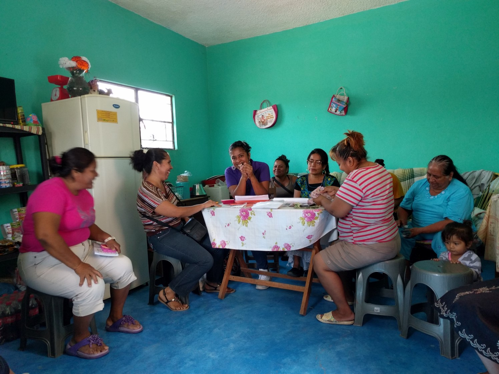

class: title-slide, inverse, center, middle

```{r setup, include=FALSE}
knitr::opts_chunk$set(echo = FALSE,
                      warning = F,
                      message = F,
                      fig.path = "figures/")

library(tidyverse)
library(sandwich)
library(estimatr) # regresión con errores robustos y agrupados
library(modelsummary) # para hacer tablas
library(ri2) # inferencia por aleatorización
library(knitr)
library(kableExtra)


xfun::pkg_load2(c('base64enc', 'htmltools', 'mime'))
```

```{css, echo = FALSE}
.huge .remark-code { /*Change made here*/
  font-size: 200% !important;
}
.tiny .remark-code { /*Change made here*/
  font-size: 60% !important;
}
```

.title[
# Evaluación Experimental
]
.subtitle[
### Una aplicación del Proyecto Esperanza en Oaxaca
]
<br/>

.author[
### Irvin Rojas <br> [rojasirvin.com](https://www.rojasirvin.com/) <br> [<i class="fab fa-github"></i>](https://github.com/rojasirvin) [<i class="fab fa-twitter"></i>](https://twitter.com/RojasIrvin) [<i class="ai ai-google-scholar"></i>](https://scholar.google.com/citations?user=FUwdSTMAAAAJ&hl=en)
]

<br/>

.affiliation[
### Centro de Investigación y Docencia Económicas <br> División de Economía  <br>  <br> Actualización: `r Sys.Date()`
]


---

# Agenda

1. Causalidad y sesgo de selección

1. Métodos experimentales para resolver el problema de selección

1. Tres pilares para una evaluación exitosa

  - Teoría
  - Diseño e implementación
  - Econometría

1. Aplicación del *Proyecto Esperanza*

1. Ejercicio de replicación

1. Reflexiones finales


---

class: inverse, middle, center

# 1. Causalidad y sesgo de selección

---

# Efectos causales

Pensemos en un tratamiento binario

$$T_i=\begin{cases}
1 \quad\text{tratado} \\
0 \quad\text{no tratado}
\end{cases}$$

El resultado que cada individuo tendría bajo cada régimen de tratamiento:
  - $y_{1i}$ con $T_i=1$
  
  - $y_{0i}$ con $T_i=0$

Supongamos que el tratamiento es recibir un trasplante y el resultado es morir (1) o seguir vivo (0) cinco días después de recibirlo (Hernan & Robins, 2018)

Supongamos que Zeus **recibió** el trasplante y a los cinco días había **fallecido**
  
Por otro lado, Hena **no recibió** el trasplante y a los cinco días seguía **seguía vivo**
  
No tardarían algunos columnistas en decir que hay que prohibir los trasplantes

---

# Efectos causales
  
Supongamos también que podemos conocer que:
  
$$y_{Zeus}=\begin{cases}
y_{1,Zeus}=1\\
y_{0,Zeuz}=0
\end{cases}$$

es decir, si no hubiera recibo el trasplante, Zeus estaría vivo cinco días después

Similarmente, conocemos que:

$$y_{Hena}=\begin{cases}
y_{1,Hena}=0\\
y_{0,Hena}=0
\end{cases}$$

**Efecto causal para un individuo**: el tratamiento tiene un efecto causal para $i$ si $y_{1i}\neq y_{0i}$
  
En nuestro ejemplo, el tratamiento tuvo un efecto causal en Zeus, pero no en Hena

---

# Resultados potenciales

$y_{1i}$ y $y_{0i}$ se conocen como resultados potenciales o contrafactuales

El término *potencial* se debe a que solo vemos uno de ellos

En nuestro ejemplo, solo observamos que $y_{0,Zeus}=y_{1,Zeus}=1$

En general, el efecto causal para un individuo no puede ser identificado

---

# Efectos causales promedio

Supongamos que podemos estudiar a la familia de Zeus, $N=20$

```{r table.personas, echo=FALSE, message=FALSE, warnings=FALSE}

personaid <- c("1","2","3","4","5","6","7","8","9","10","11","12","13","14","15","16","17","18","19","20")
y0 <- c(0,1,0,0,0,1,0,0,1,1,0,1,1,0,0,0,1,1,1,1)
y1 <- c(1,0,0,0,0,0,0,1,1,0,1,1,1,1,1,1,1,0,0,0)

table.personas <- data.frame(cbind(personaid, y0,y1))

colnames(table.personas) = c("Persona","y0","y1")

table.personas %>%
  kbl(align = "lcc",
      escape = FALSE,
      full_width = FALSE) %>%
  kable_paper(c("hover", "condensed", "responsive")) %>% 
  add_header_above(c("Efectos individuales" = 3 ),
                   bold = TRUE,
                   background = "white") %>% 
    scroll_box(height = "70%")

```


---

# Efectos causales promedio

De la tabla podemos concluir que $P(y_{1i}=1)=10/20=0.5$, es decir, la mitad de quienes reciben el trasplante morirían después de cinco días

Y también observamos que $P(y_{0i}=1)=0.5$, es decir, que la probabilidad de morir de no haber recibido el tratamiento es también de 0.5

En el anterior ejemplo, el tratamiento no tiene un efecto causal pues la probabilidad de morir con y sin el tratamiento es igual

**Efecto causal promedio** en una población: un efecto causal promedio de $T$ en el resultado $y$ está presente si $P(y_{1i}=1)\neq P(y_{0i}=1)$ en la población de interés

Cuando pensamos en **poblaciones**, podemos usar expectativas para definir el efecto causal promedio, $E(y_{1i}) \neq E(y_{0i})$, lo cual permite generalizar a resultados no binarios

La ausencia de efectos individuales promedio no implica ausencia de efectos individuales

A la afirmación de que no hay efecto causal individual para ningún individuo, $y_{0i}=y_{1i}$, para todo $i$, la llamamos hipótesis **estricta** (*sharp*) de efecto de tratamiento nulo

---

# Variabilidad aleatoria

En la práctica, casi nunca podemos observar a la población de interés, sino solo a una muestra

Por tanto, $P(y_{ti}=y)$ no puede ser observada sino estimada

Debido al error muestral, la proporción que muere en la muestra no es numéricamente igual a la proporción que muere en la población

La hipótesis que queremos probar es que hay un efecto causal en la población

Pero al trabajar con muestras, puede haber diferencias que surjan solo por el muestreo

Nuestra tarea es distinguir estas diferencias de los verdaderos efectos causales

De esto hablarán ampliamente con Curtis Huffman

---

# Sesgo de selección

¿Los hospitales hacen que la gente sea más sana?

Podemos conseguir datos de encuestas sobre cuántas veces las personas han ido al hospital en el último año


```{r table.hospital, echo=FALSE, message=FALSE, warnings=FALSE, results='asis'}

grupo <- c("Hospitalizados", "No hospitalizados", "Diferencia", "(t)")
size <- c("7,774","90,049"," "," ")
salud <- c("3.21", "3.93","0.72","(58.9)")
error <- c("0.014","0.003"," ", " ")

table.hospital <- data.frame(cbind(grupo, size, salud, error))
colnames(table.hospital) = c("Grupo","N","Salud (0-5)", "Error estándar")

table.hospital %>%
  kbl(align = "lccc",
      escape = FALSE,
      full_width = FALSE) %>%
  kable_paper(c("hover", "condensed", "responsive")) %>% 
  add_header_above(c("El efecto de los hospitales" = 4 ),
                   bold = TRUE,
                   background = "white")


```

¿Tiene sentido? ¿Los hospitales enferman?

¿Qué sucede?

---

# Comparaciones observacionales

Pensemos en términos del *Modelo de Rubin* de resultados potenciales

$$y_{i}=\begin{cases}
y_{1i}=1\quad\text{si }D_i=1\\
y_{0i}=0 \quad \text{si } D_i=0
\end{cases}$$


Solo vemos al individuo en una situación, $y_i$:

$$y_i=y_{0i}+(y_{1i}-y_{0i})D_i$$


¿Qué nos dicen las comparaciones observacionales?

Supongamos que tenemos acceso a datos sobre tratados y no tratados

Podemos calcular $E(y_i|D_i=1)-E(y_i|D_i=0)$:

$$
\begin{aligned}
E(y_i|D_i=1)-E(y_i|D_i=0)=&E(y_{1i}|D_i=1)-E(y_{0i}|D_i=0)+\\& \underbrace{E(y_{0i}|D_i=1)-E(y_{0i}|D_i=1)}_0 
\end{aligned}
$$

---

# Sesgo de selección

Reordenando:

$$
\begin{aligned}
E(y_i|D_i=1)-E(y_i|D_i=0)=&\overbrace{ E(y_{1i}|D_i=1)-E(y_{0i}|D_i=1)}^{\text{Efecto promedio en los tratados}}+\\& \underbrace{E(y_{0i}|D_i=1)-E(y_{0i}|D_i=0)}_{\text{Sesgo de selección}}
\end{aligned}
$$

El primer término nos da la diferencia promedio en la variable de salud entre los hospitalizados y lo que les hubiera pasado si no hubieran sido hospitalizados

En nuestro ejemplo, el **sesgo de selección** es la diferencia en salud entre los hospitalizados y los no hospitalizados

Específicamente, si quienes van al hospital tienen una peor salud, podemos esperar que $E(y_{0i}|D_i=1)-E(y_{0i}|D_i=0)<0$

---

# Sesgo de selección

Al hacer aseveraciones basadas en comparaciones observacionales se incluye el efecto causal del tratamiento, pero también el sesgo de selección

El sesgo de selección puede ser positivo o negativo

El objetivo de las estrategias de evaluación es eliminar el sesgo de selección

ALGO

---

# Tratamiento aleatorio

Supongamos que tenemos la posibilidad de aleatorizar el tratamiento, es decir, hacer que $Y_i$ y $D_i$ sean independientes

En ese caso, por independencia: $E(y_{0i}|D_i=0)=E(y_{0i}|D_i=1)$

De la definición de comparación observacional:

$$
\begin{aligned}
E(y_i|D_i=1)-E(y_i|D_i=0)=&E(y_{1i}|D_i=1)-E(y_{0i}|D_i=0)
\end{aligned}
$$

Sustituyendo el resultado de independencia:

$$
\begin{aligned}
E(y_i|D_i=1)-E(y_i|D_i=0)&=E(y_{1i}|D_i=1)-E(y_{0i}|D_i=1) \\
& =E(y_{1i}-y_{0i}|D_i=1) \\
& =\underbrace{E(y_{1i}-y_{0i})}_{\text{Efecto causal}}
\end{aligned}
$$

---

# Limitaciones

La aleatorización resuelve muchas cosas, pero muchas veces no es factible

¿Qué tendríamos que hacer en el caso de estudio, "¿Los hospitales matan?"

Pensemos en un programa de empleo para personas que estuvieron en la cárcel

Seguramente una comparación observacional indicaría que estos ganan menos que el resto de la población

Pero esto no significa que el programa cause un efecto negativo en el ingreso

Siempre tenemos que pensar en el contrafactual

---

class: inverse, middle, center


# 2. Métodos experimentales para resolver el problema de selección

---

class: inverse, middle, center

# 3. Tres pilares para una evaluación exitosa

---

# Tres pilares para una evaluación exitosa

1. Teoría


1. Diseño e implementación


1. Econometría

---

class: inverse, middle, center

# Primer pilar:

## Teoría

---

# Un modelo teórico de esperanza aspiracional

Banerjee et al. (2015): las microfinanzas pueden funcionar para algunos, pero no para todos

Duflo (2012): la esperanza importa

Multiples lecciones de la economía del comportamiento

- Sistemas duales
- Puntos de referencia y aversión a la pérdida
- Carencia de auto control
- Normas

En esta presentación hablaré sobre un estudio basado en estas ideas

Rojas, Wydick and Lybbert (2021), [Can hope elevate microfinance? Evidence from Oaxaca, Mexico]((https://academic.oup.com/oep/article/74/1/236/6154385?login=true)), *Oxford Economic Papers*

---

# Un modelo de la esperanza

Concepto de esperanza de la teoría de Snyder (1993)

- Aspiraciones

- Avenidas

- Habilidades

Diferencia a la esperanza *deseosa* de la **esperanza aspiracional**

Operacionalizamos estos conceptos en un modelo microeconómico

- Aspiraciones: modeladas con una función de utilidad que depende de un punto de referencia (aspiración)

- Avenidas: modeladas con una función de producción con restricciones

- Habilidad: modelada con la productividad marginal del esfuerzo

Ver [Wydick y Lybbert (2018)](https://www.journals.uchicago.edu/doi/full/10.1086/696968)

---

# Modelo microeconómico

El problema de cada individuo es

$$\max_{\{e_{t}\}} U_{t+1}=E(u_{t+1})-c(e_t)$$
Sujeto a

$Y_{t+1}=\pi e_t  + \pi_{\nu} \nu_{t+1}$


$E(Y_{t+1})= \begin{cases} \pi e_t, & \text{si } e_t < \bar{e} \\ \bar{Y}, & \text{si } e_t \geq \bar{e} \\ \end{cases}$

$u=A\left(\frac{Y}{A}\right)^\frac{1}{1-\alpha} \mathcal{1}(Y<A) + A\left(\frac{Y}{A}\right)^{1-\alpha} \mathcal{1}(Y\geq A)$

$\pi \bar{e}=\bar{Y}$


$\nu_{t+1} \sim \mathcal{N}(0,\,\sigma^{2})$

$\alpha \in[0,\,1]$


---

class: inverse, middle, center

# Segundo pilar:

## Diseño e implementación

---

# Proyecto Esperanza en Oaxacca

Colaboración con *Fuentes Libres*, una ONG cristiana

Fuentes opera en el Valle de Oaxaca y en el Istmo de Tehuantepec

En el momento del estudio tenía 52 grupos de ahorro y crédito (*bancos*)

Aleatorizamos un tratamiento en parejas de bancos que tenían características similares

- Localización
- Oficial de banco
- Tipos de negocio
- Tamaño
- Edad promedio

En cada pareja, un banco es asignado a tratamiento y otro a control

Tratamiento con tres componentes
---

# Documental *Historias de Esperanza*

.center[
<iframe width="800" height="470" src="https://www.youtube.com/embed/gAidmWKCCD0" title="YouTube video player" frameborder="0" allow="accelerometer; autoplay; clipboard-write; encrypted-media; gyroscope; picture-in-picture" allowfullscreen></iframe>
]

---

# Documental *Historias de Esperanza*

.center[
```{r}

``` 
]
---

# Ejercicio de fijación de metas

.center[
```{r}

``` 
]
---

# Mini curso de fijación de conceptos

.center[
```{r out.width="80%"}

``` 
]


---

# Valle de Oaxaca

.pull-left[
```{r}
knitr::include_graphics("http://oaxacahope-project.weebly.com/uploads/8/0/9/9/80995658/groups-map-a-comp_orig.jpg")
```
]

.pull-right[
```{r}
knitr::include_graphics("http://oaxacahope-project.weebly.com/uploads/8/0/9/9/80995658/groups-map-b-comp_orig.jpg")
```

]


---

# Istmo de Tehuantepec


.pull-left[
```{r}
knitr::include_graphics("http://oaxacahope-project.weebly.com/uploads/8/0/9/9/80995658/groups-map-d-comp_orig.jpg")
```
]

.pull-right[
```{r}
knitr::include_graphics("http://oaxacahope-project.weebly.com/uploads/8/0/9/9/80995658/groups-map-c-comp_orig.jpg")

knitr::include_graphics("http://oaxacahope-project.weebly.com/uploads/8/0/9/9/80995658/groups-map-e-comp_orig.png")
```

]

---

# Datos

Se recolecataron datos de cada socia en tres puntos del tiempo

- En la línea base
- Un mes después de la intervención
- Un año después de la intervención

Construimos índices de cada una de las dimensiones de la esperanza

Por ejemplo, para el índice de agencia (que usaremos en la replicación), pedimos a cada socia que evaluara del 0 al 10 las siguientes expresiones:
- ¿Qué tan importante es el trabajo duro para los negocios?
- ¿Qué tan importante es la suerte para los negocios?
- Mi futuro está determinado por mis propias acciones y no por las de otros
- Es difícil para personas como yo ser líderes en la comunidad
- Mujeres como yo pueden tener un impacto positivo en nuestra comunidad

Recolectamos información sobre los negocios de las socias

Tuvimos acceso a registros administrativos sobre ahorro y crédito

---

class: inverse, middle, center

# Tercer pilar:

## Econometría

---

# Integridad del diseño

Para obtener un estimador consistente del efecto del tratamiento se debe cumplir que aquellas socias que recibieron la intervención son estadísticamente iguales a las socias que no la recibieron

Se colectaron las siguientes características en la línea base y se verificó que fueran estadísticamente iguales entre el grupo tratado y el de control

.pull-left[
**Características predeterminadas**
- Edad
- Educación
- Religió
- Número de hijos
- Líder del grupo
- Tipo de negocio
]

.pull-right[
**Variables de resultados**
- Índice de aspiraciones
- Índice de agencia
- Índice de avenidas
- Felicidad
- Optimismo
- Orientación al futuro
- Aversión al riesgo
- Horas trabajadas
- Ventas
- Ganancias
- Ahorros
- Empleados

]

---

# Efecto del tratamiento

Si la aleatorización fue exitosa, el efecto del tratamiento puede obtenerse comparando las variables de resultados entre el grupo de tratamiento y control, usando los datos de seguimiento, un año después de la intervención

Lo anterior puede ser realizado con una regresión

$$y_{ij}=\alpha + \tau HopeGroup_j + X_i'\beta + \gamma D_p + \varepsilon_{i,t}$$
donde

$y_{ij}$ es la variable de impacto

$HopeGroup_j$ toma el valor de uno para las socias en el grupo de tratamiento y cero para las del grupo de control

$X_i$ son las características predeterminadas (ayudan a mejorar la precisión de la estimación)

$D_p$ es un indicador de las parejas

Los errores estándar están agrupados a nivel banco


---

# ANCOVA

[McKenzie (2015)](https://www.sciencedirect.com/science/article/pii/S030438781200003X) estudia recabar y analizar datos cuando las variables de impacto no tienen una alta correlación serial

Con baja correlación serial, un estimador ANCOVA incrementa la precisión (entre [otros beneficios](https://blogs.worldbank.org/impactevaluations/collecting-more-rounds-of-data-to-boost-power-the-new-stuff))

En el análisis extendemos la ecuación a estimar como

$$y_{ij}=\alpha + \tau HopeGroup_j + X_i'\beta + \alpha_1 y_{ij,0} + \alpha_2 My_{ij,0}+ \gamma D_p + \varepsilon_{i,t}$$

donde

$y_{ij,0}$ es el valor de la variable de impacto en la línea base


$My_{ij,0}$ es igual a 1 si el valor de la variable de impacto en la línea base es faltante y cero en otro caso

Los errores estándar están agrupados a nivel banco


---

# Inferencia por aleatorización

Es un [método para calcular los valores $p$](https://jasonkerwin.com/nonparibus/2017/09/25/randomization-inference-vs-bootstrapping-p-values/) en una prueba de hipótesis

En un experimento, sabemos qué unidades son asignadas a tratamiento y control y por medio de qué mecanismo

Inferencia por aleatorización considera **qué hubiera pasado** bajo **todas** las posibles asignaciones aleatorias, no solo la que se llevó a cabo en el experimento

El procedimiento se basa en la idea de que el efecto observado. $\beta_T$, puede ser debido no al tratamiento, sino simplemente a qué grupos fueron asignados a tratamiento y a control

Algoritmo:

2. Reasignar el tratamiento con el mismo procedimiento que como ocurrió en el experimento
3. Reestimar $\beta_{T,s}$ con la asignación de 1
4. Repetir 1 y 2 $S$ veces (1,000 quizás)
5. Comparar $\beta_T$ con la distribución de los $\beta_{T,s}$ y preguntárnos, ¿qué tan común o anormal es el $\beta_T$ estimado con la muestra del experimento?

---

# Efecto del tratamiento


```{r}
knitr::include_graphics("http://oaxacahope-project.weebly.com/uploads/8/0/9/9/80995658/ancova-combined_orig.png")
```

Nota: Efectos en las variables de impacto estandarizadas

---

# Resumen de los resultados

Los datos respaldan la hipótesis de una función de utilidad que depende de las aspiraciones (ver artículo)

Hay un efecto positivo del tratamiento sobre las aspiraciones en el corto plazo

La agencia y las agenidas responden lentamente, pero se desplazan significativamente después de un año

Hay un efecto del tratamiento sobre el índice de desempeño de negocios (explicado por el número de empleados)

Hay un efecto significantivo del tratamiento en la sobrevivencia de los bancos (ver artículo)

---

class: inverse, middle, center

# 5. Ejercicio de replicación en R

---

# Paquetes que usaremos

- *tidyverse*: manejo de datos

- *haven*: leer datos de múltiples formatos

- *sandwich*: estimación de errores robustos y agrupados

- *modelsummary*: presentar resultados en tablas

- *ri2*: realizar inferencia por aleatorización


---
# Descripción de variables

Los datos que usaremos se encuentran en el archivo *analysis_dataset.dta*


```{r echo=T}
data <- haven::read_dta("data/analysis_dataset.dta")
```

Consideremos la variable **educ**, que indica la educación de la socia en años

Usando los datos de la línea base sabemos que la edad promedio de las socias es de 7.62 años

```{r echo=T}
bl <- data %>% 
  filter(t==0)

summary(bl$educ)
```
---

# El balance

Para estimar de forma consistente el efecto del tratamiento debe suceder que la asignación al tratamiento sea independiente de las características de las socias en la línea base

Veamos la media de la educación de quienes recibieron y no recibieron el tratamiento

```{r echo=T}
#Por grupos
bl %>% 
  group_by(hopegroup) %>%
  summarize(mean=mean(educ,na.rm=T)) %>% 
  ungroup()
```

---

# El balance

Hacemos una prueba de diferencia de medias

Planteamos una hipótesis nula $H0: educ_{tratadas}=educ_{no tratadas}$

Construimos un estadístico $t$ y formulamos una regla de decisión

Si $p<\alpha=0.05$ rechazamos la $H_0$

.scroll-output[

```{r echo=T, message=F}
t.test(educ ~ hopegroup,
       data = bl)
```
]
---

# El balance

Podemos hacer uso de una regresión lineal para hacer exactamente lo mismo

$$educ_i=\gamma_0 + \gamma_1 HopeGroup_i + e_i$$

```{r echo=T}
summary(m1 <- lm(educ ~ hopegroup,
   data = bl))$coef[,c(1:2,4)]
```

---

# El balance

Sin embargo, la prueba realizada anteriormente asume que los errores son independientes e idénticamente distribuidos (iid)

En otras palabras, que los individuos en nuestra muestra reciben choques aleatorios que no están correlacionados

Esto no sucede en nuestro caso: tenemos socias que son parte de grupos de crédito y ahorro y que, por tanto, reciben choques que están correlacionados (mercado laboral, clima, programas)

Debemos tomar en cuenta que estos errores no son independientes para estimar correctamente la matriz de varianzas de $\hat{\beta}$

---

# El balance

La función *lm_robust* funciona como *lm* pero podemos especificar errores agrupados

```{r echo=T}
summary(m1r <- lm_robust(educ ~ hopegroup,
                         clusters = communitybank,
                         se_type = "CR0",
                         data = bl))$coef[,c(1:2,4)]
```
---

# El balance

En una evaluación, tenemos que verificar el supuesto de independencia al mostrar evidencia de que las características de los individuos **antes** de la intervención no difieren entre tratados y no tratados

Estimo una regresión para cada características usando la especificación que usé antes para la educación

Guardo los resultados en una lista llamada *models*

```{r echo=T}
#Para el resto de los covariables
models <- list()

models[['Edad']] <- lm_robust(age ~ hopegroup,
                                   clusters = communitybank,
                                   se_type = "CR0",
                                   data = bl)

models[['Educación']] <- lm_robust(educ ~ hopegroup,
                         clusters = communitybank,
                         se_type = "CR0",
                         data = bl)
```

```{r}
models[['Prop. evangélica']] <- lm_robust(evangelical ~ hopegroup,
                         clusters = communitybank,
                         se_type = "CR0",
                         data = bl)
models[['Hijos']] <- lm_robust(children ~ hopegroup,
                         clusters = communitybank,
                         se_type = "CR0",
                         data = bl)
models[['Líder']] <- lm_robust(bankleader ~ hopegroup,
                         clusters = communitybank,
                         se_type = "CR0",
                         data = bl)
```

---

# El balance

Puedo presentar los resultados de estimar la misma especificación para varias características usando *modelsummary*

```{r echo=T, eval=F}
modelsummary::modelsummary(models,
                           statistic = "std.error",
                           coef_map = c('hopegroup' = "Hope Group"),
                           coef_omit = "Intercept",
                           gof_omit = 'DF|Deviance|R2|AIC|BIC',
                           stars=c('*' = .1, '**' = .05, '***'=0.01),
                           title = "Balance de X en línea base")

```
---

# El efecto del tratamiento

Si el supuesto de independencia se cumple, el efecto del tratamiento en una variable $y$ puede ser identificado simplmente al comparar $y$ para tratados y no tratados **después de la intervención**

Sabemos que podemos hacer esto con una regresión como sigue

$$y_i=\beta_0+\beta_1 HopeGroup_i + \varepsilon_i$$

donde $\hat{\beta_1}$ es el efecto del tratamiento

Estimemos el efecto de haber sido asignado a la intervención del Proyecto Esperanza sobre un índice de agencia, **StdAnderAgencyIndex** usando los datos recabados un año después del tratamiento

---

# El efecto del tratamiento

Primero estimemos una regresión con errores robustos (ignorando errores agrupados)

```{r echo=T}
summary(e0a <- lm_robust(StdAnderAgencyIndex ~ hopegroup,
                        se_type = "HC1",
                        data = filter(data, t==2)))$coef[1:2, c(1:2,4)]
```

El tratamiento tiene un efecto positivo de 0.14 $\sigma$ en el índice de agencia

Este efecto es estadísticamente significativo (0.054)

---

# El efecto del tratamiento

Notemos qué pasa cuando agregamos un vector de *controles*

Es común en evaluación estimar una *regresión larga*

$$y_i=\beta_0+\beta_1 HopeGroup_i + BX_i +  \varepsilon_i$$

donde $X_i$ representa un vector de características que explican $y_i$, pero que no fueron afectadas por el tratamiento

```{r echo=T}
summary(e0b <- lm_robust(StdAnderAgencyIndex ~ hopegroup + age + educ + evangelical + children + children_under_18 + bankleader + Dwelling_Index,
                        se_type = "HC1",
                        data = filter(data, t==2)))$coef[1:2,c(1:2,4)]
```
---

# El efecto del tratamiento

Primero hagamos más corto lo que tenemos que escribir

```{r echo=T}
X <- c("hopegroup", "age", "educ", "evangelical", "children", "children_under_18", "bankleader", "Dwelling_Index")

reglarga <- as.formula(paste("StdAnderAgencyIndex ~ ",
                             paste(X, collapse= "+")))

reglarga
```
---

# El efecto del tratamiento

Podemos sustituir *reglarga* en la parte donde va la especificación de la regresión

```{r echo=T}
summary(e1 <- lm_robust(reglarga,
                        clusters = communitybank,
                        se_type = "CR0",
                        data = filter(data, t==2)))$coef[1:2,c(1:2,4)]

```
---

# El efecto del tratamiento

Recordemos que la aleatorización ocurrió por parejas,
entonces debemos incluir efectos fijos por parejas para comparar entre socias de grupos comparables


```{r echo=T}
summary(e2 <- lm_robust(reglarga,
                        fixed_effects = pair_number,
                        clusters = communitybank,
                        se_type = "CR0",
                        data = filter(data, t==2)))$coef[1:2,c(1:2,4)]
```

---

# El efecto del tratamiento

Comparamos las estimaciones que hemos hecho hasta ahora

```{r echo=T, eval=F}
modelsummary::modelsummary(list('Errores Robustos'=e0a,
                                'Errores Robustos + X'=e0b,
                                'Errores agrupados + X'=e1,
                                'Errores agrupados + X + parejas'=e2),
                           statistic = "std.error",
                           coef_map = c('hopegroup' = "Hope Group"),
                           coef_omit = "Intercept",
                           gof_omit = 'DF|Deviance|R2|AIC|BIC',
                           stars=c('*' = .1, '**' = .05, '***'=0.01),
                           title = "Efectos de tratamiento en el índice de agencia 12 meses después de la intervención")
```

---

# ANCOVA

Introducimos el valor en la línea base del índice de agencia y un indicador de si dicho valor no fue colectado en la línea base

```{r echo=T, eval=T, results=F}
X <- c("hopegroup", "age", "educ", "evangelical", "children", "children_under_18", "bankleader", "Dwelling_Index", "Baseline_StdAnderAgencyIndex", "M_Baseline_StdAnderAgencyIndex")

reglarga <- as.formula(paste("StdAnderAgencyIndex ~ ",
                             paste(X, collapse= "+")))

summary(e3 <- lm_robust(reglarga,
                        fixed_effects = pair_number,
                        clusters = communitybank,
                        se_type = "CR0",
                        data = filter(data, t==2)))$coef[,c(1:2,4)]

```

---

# Inferencia por aleatorización

Declaramos la estructura del experimento

- Clusters: bancos
- Bloques: parejas

Usamos los datos del seguimiento de un año

.pull-left[
```{r echo=T}
set.seed(322)

df <- filter(data, t==2)

declaration <- 
  with(df,{
    declare_ra(
      blocks = pair_number, # bloques = parejas
      clusters = id_g, # clusters o grupos = bancos
      )
  })
```
]

.pull-right[
```{r echo=F}
declaration
```
]
---

# Inferencia por aleatorización

La función *conduct_ri* realiza la asignación y la estimación en cada una de las $s$ repeticiones

```{r echo=T, cache=T}
ri <- conduct_ri(
  StdAnderAgencyIndex ~ hopegroup,
  assignment = "hopegroup",
  sharp_hypothesis = 0,
  declaration = declaration,
  data = df,
  sims = 1000
)

summary(ri)
```

En el 20% de las 1,000 repeticiones el efecto estimado fue al menos tan grande como el efecto de 0.1613 con los datos del experimento

El valor $p$ estimado es 0.206

---

# Inferencia por aleatorización

Agregamos controles

```{r echo=T, cache=T}
ri <- conduct_ri(
  StdAnderAgencyIndex ~ hopegroup +
  age + educ + evangelical + children + children_under_18 + bankleader + Dwelling_Index +
  factor(pair_number) + Baseline_StdAnderAgencyIndex +M_Baseline_StdAnderAgencyIndex,
  assignment = "hopegroup",
  sharp_hypothesis = 0,
  declaration = declaration,
  data = df,
  sims = 1000
)

summary(ri)
```

El valor $p$ es de 0.077

Esto contrasta con el valor $p$ obtenido de forma tradicional de 0.06

---

class: inverse, middle, center

# 6. Reflexiones finales

---

# Reflexiones finales

1. Conozcan su teoría

2. Cosas a considerar en el diseño y la implementación
  - Escala
  - Ética
  - Costo
  - Compromiso entre las partes

3. Análisis
  - Pre registro de estudios
  - Métodos apropiados para el diseño apropiado
  - La econometría no resuelve un mal diseño

4. Siempre habrá problemas

5. Estamos para apoyar


---

class: center, middle, inverse

# ¡Gracias!

.author[
### [rojasirvin.com](https://www.rojasirvin.com/) <br> [<i class="fab fa-github"></i>](https://github.com/rojasirvin) [<i class="fab fa-twitter"></i>](https://twitter.com/RojasIrvin) [<i class="ai ai-google-scholar"></i>](https://scholar.google.com/citations?user=FUwdSTMAAAAJ&hl=en)
]

<br/>

<br/>


Presentación creada usando el paquete [**xaringan**](https://github.com/yihui/xaringan) en R.

El chakra viene de [remark.js](https://remarkjs.com), [**knitr**](https://yihui.org/knitr/), y [R Markdown](https://rmarkdown.rstudio.com).
